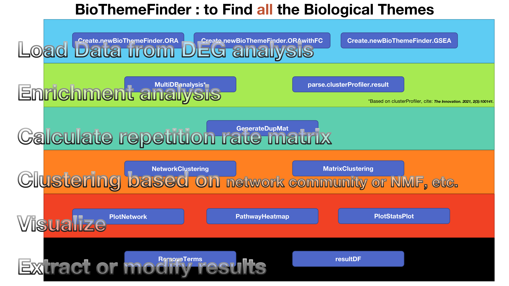

# BioThemeFinder

This package is an expansion pack of the famous package "clusterProfiler". BioThemeFinder presents an enrichment analysis method for multi-database union (like GO, KEGG, Reactome and self-defined gene sets, etc. Also, redundant enrichment results can be turned into more explanatory biological stories using methods such as NMF or network-based community clustering.

## Description

## Installation

    library(devtools)
    install_github("ZhimingYe/BioThemeFinder")
    
## Demo

### 载入R包

    library(BioThemeFinder)
    library(clusterProfiler)
    library(ReactomePA)
    library(org.Hs.eg.db)
    library(org.Mm.eg.db)

这里的Gene名字和差异表达数值均为vector。差异表达数值可以来自DEG分析的log2FC，也可以来自ROC的power等（例如Seurat）。 LUAD_DEG为TCGA肺腺癌差异基因数据。为本包自带示例数据。

### 创建BioThemeFinder对象

1.  `Create.newBioThemeFinder.ORA` 只有Gene名，使用过表达分析（ORA）进行分析
2.  `Create.newBioThemeFinder.ORAwithFC` 具有Gene名、衡量基因表达差异的数值情况，使用过表达分析（ORA）进行分析
3.  `Create.newBioThemeFinder.GSEA` 具有Gene名、衡量基因表达差异的数值情况，使用GSEA进行分析

这里我们用以第二个情况作为demo。

`Species`为物种，支持人和小鼠（mouse），`FromType`为纳入的基因ID类型，可以是`ENSEMBL`, `ENTREZID`, `SYMBOL`等。

可以使用`?`在每个函数前面看具体的帮助文档。

    data("LUAD_DEG")
    BTFdemo<-Create.newBioThemeFinder.ORAwithFC(Gene = rownames(LUAD_DEG),log2FC = LUAD_DEG$log2FoldChange,Pvalue =LUAD_DEG$padj,FCcutoff = 1,PvalueCutOff = 0.05,Species = "human", FromType="ENSEMBL")

### 进行多数据库富集分析

`DBlist`可以是GO, KEGG, Reactome, SelfDefinedGS。

当纳入自定义数据库（SelfDefinedGS）的时候，需要用`Term2GENE`传入自定义基因集。

具体帮助使用`?MultiDBanalysis`查看。

另外还可以使用`parse.clusterProfiler.result`直接从clusterProfiler导入结果对象。

    BTFdemo<-MultiDBanalysis(BTFdemo,PVal = 0.05,QVal = 0.05,DBlist = c("GO","KEGG","Reactome"),nGeneCutOff = 5,simplify_cutoff = 0.7,useMKEGG = T)
    
预览富集结果

    PathwayStatsPlot(BTFdemo,orderBy = "pValue")

### 计算Term之间纳入的基因重复度

可以传入`EdgeCutoff`参数，决定重复度大于多少的两个富集分析到的通路才被纳入绘制网络。默认为0.5。

    BTFdemo<-GenerateDupMat(BTFdemo)

可以使用`PathwayHeatmap(BTFdemo)`预览之。注意该图片对于R预览可能过大。请导出成50x50英寸左右的PDF，在PDF浏览器中查看。

    PathwayHeatmap(BTFdemo)

图片解读：

### 基于网络聚类

    BTFdemo<-NetworkClustering(BTFdemo)

### 网络聚类可视化

    PlotNetwork(BTFdemo,method = "igraph",Label = T)
    PlotNetwork(BTFdemo,method = "igraph",Label = F)
    PlotNetwork(BTFdemo,method = "ggplot2",Label = T)

### 基于矩阵的聚类

可以使用的聚类工具有"nmf","hc","pam","fuzzy"。可以通过`method`传入。nmf为非负矩阵分解方法，hc为层次聚类方法，pam为围绕中心点的划分（Partitioning Around Medoid）方法，fuzzy为模糊聚类（Fuzzy Clustering）。具体的帮助请`?MatrixClustering`。

`k`可以通过概览`PathwayHeatmap`大致确定。

    BTFdemo<-MatrixClustering(BTFdemo,k=20,method="nmf")
    
### 基于热图的可视化

`clusterType`可以为"MatrixResult", "NetworkResult"之一。后文同

    PathwayHeatmap(BTFdemo,using_cluster=T,clusterType="NetworkResult")

### 分面的点图
    
具体帮助可以使用`?PathwayStatsPlot`查看。加入`+ facet_grid(~Cluster)`进行分面。

可以看到，每个模块的功能十分清晰，同时很好的利用了多数据库。

    PathwayStatsPlot(BTFdemo,orderBy = "pValue",clusterType="NetworkResult")+ facet_grid(~Cluster)
    PathwayStatsPlot(BTFdemo,orderBy = "pValue",clusterType="NetworkResult")+ facet_grid(~Cluster)

### 提取结果

    Genes<-ExtractGenes(BTFdemo,clusterType="NetworkResult")
    Result<-resultDF(BTFdemo)
